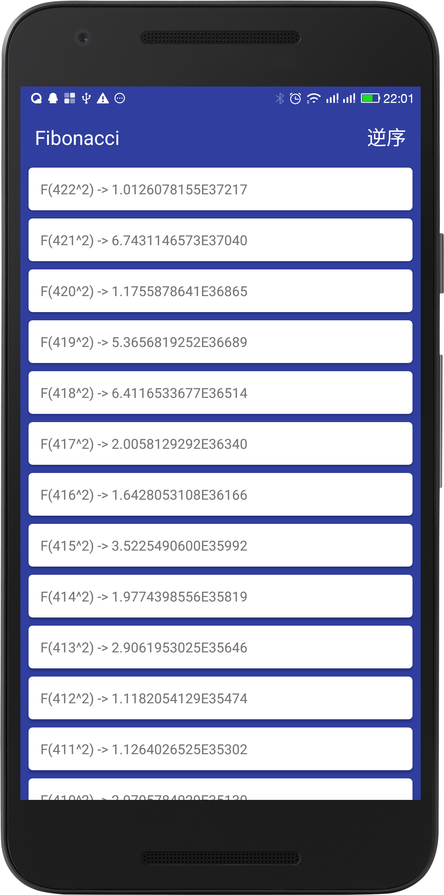

# Fibonacci
## 要求:
- 请实现一个可以显示斐波那列表的activity<br>
- 请编写文档介绍你都做了那些很酷的事情<br>
- 项目必须可以在Android SDK 4.0以上的版本与环境下运行<br>
- 提交一个完整的,可运行的Android项目包<br>
- 压缩打包代码和文档,命名为[名字]  

### 斐波那契数列定义(Fibonacci)
 - F(0) = 0;
 - F(1) = 1;
 - F(n) = F(n-1) + F(n-2);

## 题目:
a.1.请写一个仅有一个列表页面的Android应用  
a.2.列表从0开始,从小到大,每行显示一个斐波那器数字  
a.3.列表第n行显示F(n^2),至少显示到F(450^2)  
a.4.列表必须保持流利滑动  
a.5.当数值超过10^10时,用科学计数法表示Fibonacci的值  
a.6.不允许计算完所有的值之后再显示  
a.7.可以使用BigInteger来存储F(n)的值  
b.1.在界面上价一个切换顺序的按钮  
b.2.点击按钮会在"从小达大"和"从大到小"排序之间切换.  

## 项目

>[完成的Fibonacci列表项目github地址https://github.com/SuperMan42/Fibonacci](https://github.com/SuperMan42/Fibonacci)  
apk在工程art目录下  
完成了所有功能,演示视频:在工程art目录下

<iframe height=498 width=510 src="art/演示视频.mp4" frameborder=0 allowfullscreen></iframe>

  

### 列表
>用了RecyclerView实现列表,添加了下拉刷新和上拉加载,逆序

```java
coreRecyclerView.init(new BaseQuickAdapter<String, BaseViewHolder>(R.layout.item) {
    @Override
    protected void convert(BaseViewHolder helper, String item) {
        helper.setText(R.id.value, item);
    }
}).addOnItemClickListener(new OnItemClickListener() {
    @Override
    public void SimpleOnItemClick(BaseQuickAdapter adapter, View view, int position) {
        showToast("点击了" + position);
    }
}).openLoadMore(num, page -> mPresenter.getData(num, page, sort))
        .openRefresh();
```

### 算法
>我们知道递归算法是最差的,因为会重复计算好多,所以我们要找其他方法
- 解法一：递推关系式的优化
用一个数组存储所有已计算过的项。这样便可达到用空间换时间的目的。在这种情况下，时间复杂度为O(n)，空间复杂度也为O(n)。
- 解法二：求通项公式
如果我们知道一个数列的通项公式，使用公式来计算会更加容易。  
特征方程为：x2=x+1，有两个特征根x1，x2。  
则通项为F(n)=Ax1n+Bx2n，其中A，B可以通过F(0)和F(1)计算出来。  
通过通项公式，我们可以在O(1)时间内求出F(n)。但公式中引入了无理数，所以不能保证结果的糖度。  
- 解法三：分治策略
存在2*2的矩阵A，使得：
[Fn Fn-1] = [Fn-1, Fn-2]*A  
通过递推可以求得A={{1, 1}{1, 0}}  
且：[Fn Fn-1] = [Fn-1, Fn-2]*A = [Fn-2, Fn-3]*A2= ... = [F1, F0]*An-1  
剩下的问题就是求解矩阵A的方幂。  

```java
//计算斐波那契
private static BigInteger[][] fb(int n) {
    if (n == 0) {
        return ZERO;
    }
    if (n == 1) {
        return UNIT;
    }
    if ((n & 1) == 0) {
        BigInteger[][] matrix = fb(n >> 1);
        return matrixMultiply(matrix, matrix);
    }
    BigInteger[][] matrix = fb(((n - 1) >> 1));
    return matrixMultiply(matrixMultiply(matrix, matrix), UNIT);
}
private static BigInteger[][] matrixMultiply(BigInteger[][] m, BigInteger[][] n) {
    int rows = m.length;
    int cols = n[0].length;
    BigInteger[][] r = new BigInteger[rows][cols];
    for (int i = 0; i < rows; i++) {
        for (int j = 0; j < cols; j++) {
            r[i][j] = BigInteger.valueOf(0);
            for (int k = 0; k < m[i].length; k++) {
                r[i][j] = r[i][j].add(m[i][k].multiply(n[k][j]));
            }
        }
    }
    return r;
}
```

### 多线程
>通过线程池的运用实现了多线程去计算斐波那契数列

```java
ExecutorService service = Executors.newCachedThreadPool();
```

### 缓存
>实现了内存和磁盘缓存来加快加载列表  
内存缓存的实现用了SparseArray,arraymap的key可以是任意值,SparseArray的key只能为int,其核心是折半查找  
  

```java
private static void addReturnData(List<String> s, int i, boolean sort) {
    String string = null;
    int position = i;
    if (!sort) {
        position = total - 1 - i;
    }
    if (sparseArray.get(position) != null) {
        string = sparseArray.get(position).toString();
    } else if (aCache.getAsString(String.valueOf(position)) != null) {
        string = aCache.getAsString(String.valueOf(position));
        sparseArray.put(position, string);
    } else {
        string = format(position);
        sparseArray.put(position, string);
        aCache.put(String.valueOf(position), string);
    }
    s.add(string);
}
```
>先从内存取数据,如果有则返回数据,如果没有再去磁盘取数据,如果命中则添加到内存缓存中,返回数据,如果没有命中则去通过算法计算斐波那契数列,然后加入到内存和磁盘缓存中  
通过sparseArray实现内存缓存可以实现快速逆序加载  

### 数据

```java
private static final BigInteger bigInteger0 = BigInteger.ZERO;
private static final BigInteger bigInteger1 = BigInteger.ONE;
private static final BigInteger temp = BigInteger.TEN.pow(10);
private static final DecimalFormat decimalFormat = new DecimalFormat("0.0000000000E00");
```
>使用了BigInteger存储数据(提高精度),使用了DecimalFormat对超过10^10的数据进行科学计数

### 其他
>使用了MVP来实现这个activity(虽然大材小用,但是逻辑清晰,便于替换数据源)
